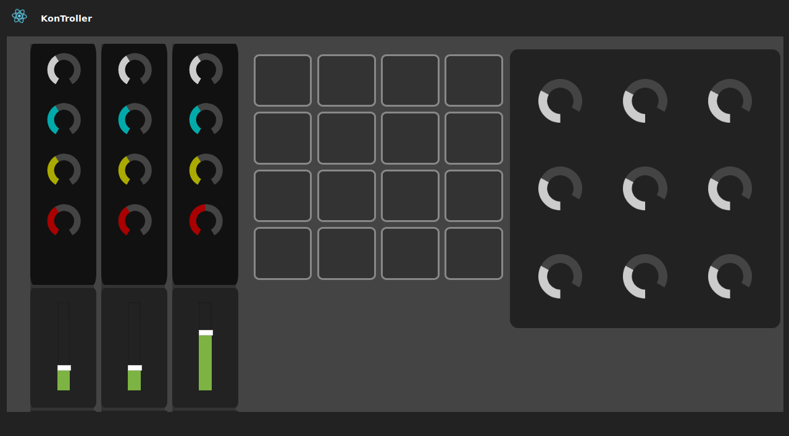

# MusiKontrol

React-Based music MIDI controller app.  

- Frontend in `panel-frontend` ,  run `npm install` to install modules and  `npm start` to run GUI 
- MIDI server in  `midi-server` , run `npm install` to install modules and  `npm start` to run server

